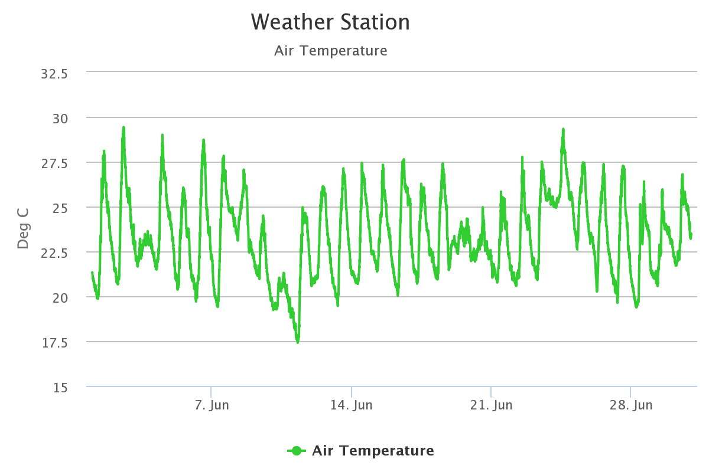

# Assignment-2-Data-Visualisation-Project

develop a system that creates a representation of the sensor data from building 11

## [Demo](https://unicar9.github.io/Assignment-2-Data-Visualisation-Project/)

## Project Description:

This is an interactive data representation system with creative audio and visual effects. The data and the technics we used will be introduced as below:

### Data:

We used Air Temperature data produced by the weather station from the 1st of June to the 1st of July this year. The reason we chose the data is that temperature is closely associated with our daily life. The information is easy to interpret and understand, as well as meaningful to us.

### Mapping:

#### Summary:

We grouped the data based on dates, and each data contains a date-time and a Celsius degree at that time, such as `["2021-06-01 00:01:20", 21.33]`, each data point was represented visually as a small circle or a square and a vertical motion trail. Every time a user clicks on the screen, it will generate a whole day's data points and a music note matching each data point.

#### Specification:

- Shapes: circle or square

All the data points belong to the first half of the day, before noon, is a circle; otherwise, a square.

- Moving direction: upward or downward

All the data points belong to the first half of the day, before noon, it's moving upward; otherwise, moving downward.

- Colors: 5 hues with variations

The degree in each data point is mapped proportionally to 5 colours with random variations. Lower temperature is matched to cooler colours like purple or blue, and higher temperature to warmer colours like orange or red.

- Music notes:

The degree in each data point will be mapped proportionally to 2 notes in successive octaves: the higher temperature, the higher pitch.

### Interaction:

- Press left or right arrow keys:

Switch to another day's data representation, left to the previous day, right to the next day.

- Click on the screen:

Jump to the next day's data representation.

- Hover on each circle or square

Display the date-time and degree information

**Note: when data is generating, click or keypress is disabled.**
